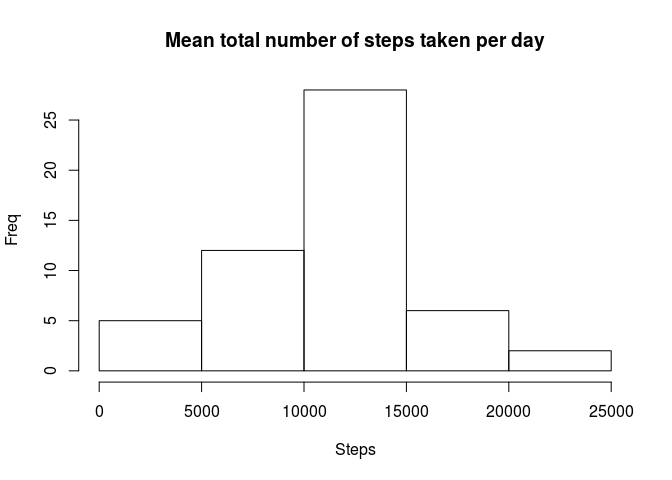
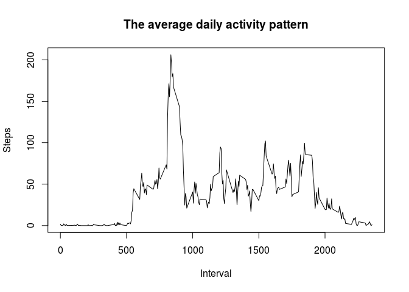
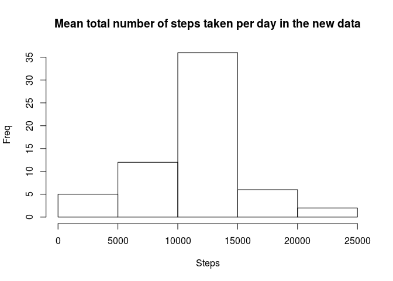
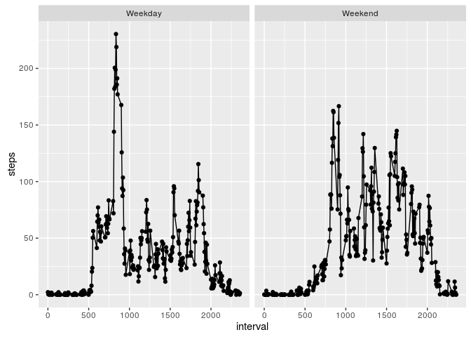

# Reproducible Research: Peer Assessment 1


## Loading and preprocessing the data


```r
dt <- read.csv("activity.csv", na.strings = "NA")
dt$date <- as.Date(dt$date,"%Y-%m-%d")
dtomit <- na.omit(dt)
dt2 <- aggregate(steps ~ date, FUN = sum, data = dt)
meansteps <- mean(dt2$steps)
mediansteps <- median(dt2$steps)
```


## What is mean total number of steps taken per day?


```r
hist(dt2$steps, xlab="Steps", ylab = "Freq", main = "Mean total number of steps taken per day")
```

<!-- -->

The mean of total number of steps taken per day is 1.0766189\times 10^{4}.
The median of total number of steps taken per day is 10765.

## What is the average daily activity pattern?


```r
dt3 <- aggregate(steps ~ interval, FUN = mean, data = dtomit)
plot(dt3, type = "l", xlab = "Interval", ylab = "Steps", main = "The average daily activity pattern")
```

<!-- -->
The 5-minute interval contains the maximum number of step is 835.

## Imputing missing values

```r
naval <- sum(is.na(dt$steps))
```
Total number of missing values in the dataset is 2304

Make a new dataset with the missing data filled in with mean value of same interval

```r
dtnew <- dt
dtnew$steps[is.na(dt$steps)] <- dt3$steps[match(dt$interval, dt3$interval)][is.na(dt$steps)]
```

The new plot of new data

```r
dt2new <- aggregate(steps ~ date, FUN = sum, data = dtnew)
hist(dt2new$steps, xlab="Steps", ylab = "Freq", main = "Mean total number of steps taken per day in the new data")
```

<!-- -->

## Are there differences in activity patterns between weekdays and weekends?

Make a new factor variable in the dataset with two levels -- "weekday" and "weekend"

```r
dtnew <- transform(dtnew, weekday = ifelse(weekdays(date) %in% c("Saturday", "Sunday"), "Weekend", "Weekday"))
```
Processing data for plotting

```r
dtweekday <- dtnew[dtnew$weekday == "Weekday",]
dtweekend <- dtnew[dtnew$weekday == "Weekend",]

dtweekday <- aggregate(steps ~ interval + weekday, FUN = mean, data = dtweekday)
dtweekend <- aggregate(steps ~ interval + weekday, FUN = mean, data = dtweekend)

dtwd <- rbind(dtweekend, dtweekday)
```
The plot of steps between weekend and weekday:

```r
library(ggplot2)
g <- qplot(interval, steps, data = dtwd, facets = .~weekday)
g + geom_line()
```

<!-- -->
